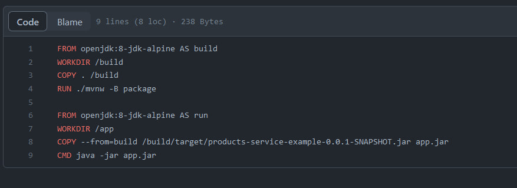
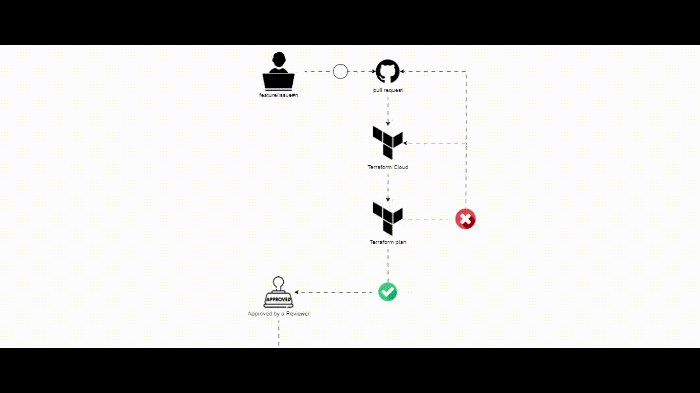
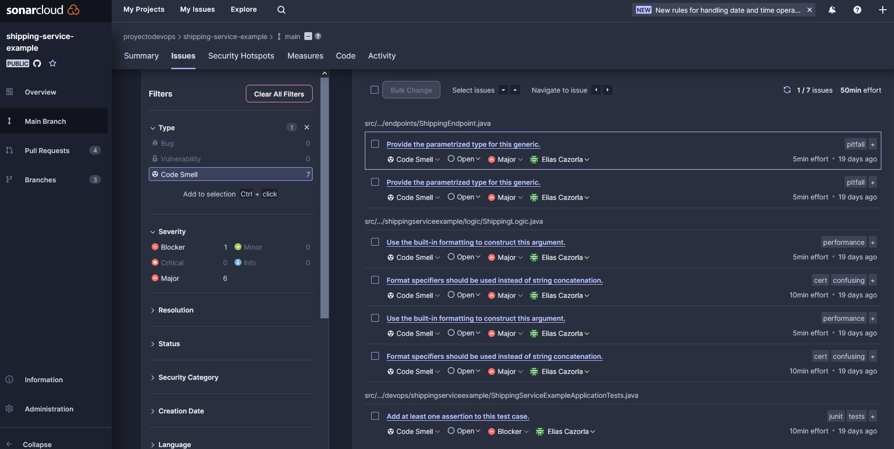

# Implementación realizada para el proyecto.

En este documento se detallan las implementaciones, acciones y resultados obtenidos durante el proceso de realización del proyecto por parte del equipo.

Para el desarrollo del proyecto se decidió dividir el mismo en sprints, a continuación se detallarán los mismos:

## **Sprint 1.**

### **Kanban:**
Para el primer sprint se decidió comenzar por crear un tablero Kanban dentro de la plataforma Trello para el control de las tareas a realizar.

*tablero kanban.*

Dentro del mismo se decidió crear 5 columnas para los distintos estados de las tareas a realizar:

1. **Backlog**: Lista de tareas a realizar en un futuro ordenadas.
2. **To-Do**: Lista ordenada de tareas a realizar en un tiempo determinado reciente.
3. **Doing**: Lista de tareas que están siendo realizadas.
4. **Review**: Lista de tareas que fueron realizadas y están siendo revisadas.
5. **Done**: Lista de tareas realizadas y verificadas.

A su vez se decidió agregar tags para representar los ambientes de `FRONTEND`, `BACKEND` y `DEVOPS`, también un tag para documentación y tags para marcar los sprints.

### **Organización en Github.**

Para el control y organización de los repositorios se decidió crear una organización en Github.

*organización.*

### **Repositorio FrontEnd.**

Dentro de la organización mencionada se creó el repositorio para almacenar el código del FrontEnd.

También se crearon las ramas main, staging y develop para manejar un Git Flow donde a su vez para cada tarea se generaron issues dentro de Github con su feature branch para realizar la implementación y generar pull requests.

*issue.*

*branch.*

*pull request.*

### **Pipelines CI/CD Frontend.**

Para los pipelines de CI/CD decidimos ir por github actions. Creamos un total de 6 workflows, 3 de ellos (1 por ambiente) invocan a un workflow aparte llamado
build-and-deploy que se encarga de hacer build de la aplicación y desplegarla a un bucket de S3.
Además creamos 1 workflow que corre cuando se crea o actualiza un PR sobre cualquiera de los 3 ambientes para validar que los nuevos cambios pasen los linters o no rompan el build. Este último workflow invoca también a otro llamado build para que se encargue de correr los pasos anteriormente detallados.

## **Sprint 2.**

### **Repositorio infraestructura.**

Se creó un repositorio dentro de la organización para gestionar todos los cambios referentes a la infraestructura del proyecto.

*repositorio infraestructura.*

Para la integración de código se decidió seguir el modelo de Trunk Based donde los cambios se incorporan a una única rama "tronco" que en nuestro caso es main. A su vez también empleamos el mismo flujo de feature branches que utilizamos para el repositorio del FrontEnd.

### **Arquitectura de Terraform.**

Para la arquitectura de los archivos de terraform decidimos utilizar tf vars para el manejo de los ambientes. 

Decidimos seguir este formato:

*arquitectura de terraform.*

**archivos.tfvars**: Sobreescribe las variables dependiendo del ambiente en el que se encuentra.

**eks-cluster.tf**: Se definen los recursos necesarios para la implementación del cluster eks.

**outputs.tf**: Se encuentran los outputs de la infraestructura.

**providers.tf**: Se define el proveedor requerido, que en este caso es aws, se elige su versión y su región.

**s3-bucket.tf**: Están los recursos necesarios para la creación del bucket s3.

**variables.tf**: Se definen las variables de entrada.

### **Directorio Kubernetes.**

Este directorio contiene lo necesario para poder desplegar los aplicativos al cluster de EKS. Decidimos utilizar Helm como herramienta para poder manejar las aplicaciones en kubernetes.

*directorio kubernetes.*

**ingress.yaml**: Este archivo contiene la definición del único objeto ingress necesario para exponer los servicios del cluster al exterior del mismo. Se va a aplicar en cada deploy que se haga de los microservicios del backend. Cabe aclarar que el ingress por si solo no tiene efecto, además de tener que configurarlo hay que también usar un controller. En nuestro caso decidimos ir por el ingress controller de NGINX para satisfacer el ingress. 
Cada vez que se despliega el aplicativo se hace un upgrade del mismo.

**helm-charts**: Este directorio contiene los charts de los micro servicios. Los mismos están compuestos por los objetos deployment y service correspondientes. 

### **Terraform Cloud.**

Utilizamos la herramienta Terraform Cloud para el manejo de CI/CD y el control de los estados de Terraform.

Para el uso de Terraform Cloud seguimos los siguientes pasos:

1. Creamos la organización para el proyecto.
2. Creamos 3 workspaces uno para cada ambiente que escuchan a la rama main por cambios.

    *workspaces en terraform cloud.*

3. Creamos un set de variables para las credenciales de AWS y las aplicamos para los 3 workspaces o ambientes.

    *set de variables en terraform cloud.*

4. Configuramos estas variables en todos los ambientes:

    *variables específicas del workspace en terraform cloud.*

5. Cambiamos las settings para tener auto apply en dev, pero no en staging ni en prod.

    *Configuración Auto apply.*

### **Repositorios BackEnd.**

Para el código de las 4 aplicaciones del BackEnd se generaron 4 repositorios que siguen la misma estructura basada en un Git Flow con develop, main y staging y feature branches.

Los 4 aplicativos son:

1. **Products Service**: Microservicio aislado.
2. **Shipping Service**: Microservicio aislado.
3. **Payments Service**: Microservicio aislado.
4. **Orders Service**: Microservicio dependiente de los anteriores.

### **Dockerfile.**

En el caso del Dockerfile de las aplicaciones se está implementando como buena práctica el uso de multi stages, que nos permite crear diferentes etapas dentro del mismo, obteniendo como resultado una imagen minimal. En este caso se realiza el empaquetado del aplicativo y luego a partir de ese stage se ejecutan los pasos para ejecutar la aplicación.

*Dockerfile de los aplicativos backend.*

### **Workflows BackEnd.**

Con respecto a los workflows de las aplicaciones del BackEnd, al momento de realizar un pr se ejecuta un workflow que realiza el build del aplicativo, el análisis de Sonar y tests de la API con postman. Luego al momento de realizar una incorporación se ejecuta otro workflow que se encarga de hacer el build y análisis de Sonar(esta vez de la rama a la que se incorporaron los cambios), seguidos de un build y push de la imágen tagueada con el SHA del commit a Docker Hub y por último se hace el deploy al cluster de EKS.

### **Sonar Cloud.**

Se agregó Sonar Cloud como herramienta para realizar análisis de código estático, donde realizamos un análisis sobre las 3 ramas principales del FrontEnd y del BackEnd al momento de realizar un pr sobre las mismas y al momento de realizar una incorporación de código nuevo.

Esta herramienta nos permite controlar la fiabilidad (mostrando los bugs del código), mantenibilidad (mostrando code smells), seguridad (mostrando vulnerabilidades), entre otros demás controles, además nos muestra donde se encuentran y cómo solucionarlos.

*herramienta Sonar Cloud.*

### **Postman testing**

Se empleó Postman junto con Newman para realizar pruebas automatizadas de las API de cada microservicio.

Estas pruebas se realizan al momento de crear un pr en las ramas principales (develop, staging y main). 

La implementación se basa en levantar un contenedor con el aplicativo y otro para postman, utilizando newman para correr la colección con las API del microservicio y así generar un reporte de los test previamente creados en la colección.

Estos test muestran el resultado en la consola de workflows de Github y también generan un html con el reporte.

*docker compose para ejecutar pruebas a través de postman.*

*reporte*

## **Sprint 3.**

### **Diagrama Git Flow.**

Nuestra definición de Git Flow se basa en 3 ramas principales (develop, staging y main) donde empleando feature branches se va integrando el código en cada ambiente.

### **Diagrama Trunk Based.**

Nuestra definición de Trunk Based se centra en una rama (main) donde mediante feature branches se va integrando el código.

### **Diagrama CICD FrontEnd.**

Para el manejo de CICD en el FrontEnd nos centramos en un flujo donde el desarrollador al terminar la implementación en una feature branch, realiza un pr con el/los commits hacia develop.

Ese pr dispara Github Actions donde se controla los linters del FrontEnd, se realiza el empaquetado del aplicativo y se ejecuta un análisis de Sonar Cloud, estos pasos son consecutivos si el paso anterior se ejecuta exitosamente, si ocurre un error en algún paso se visualizará en el pr en Github.

Luego de completar las acciones de manera correcta el pr queda pronto para que un Reviewer se encargue de confirmar el merge.

Al completar el merge se disparan otras Github Actions donde nuevamente se controlan los linter, se realiza el empaquetado de la aplicación, se realiza el deploy al s3 de AWS y se realizan las pruebas de Sonar Cloud, estos pasos siguen la misma lógica de los del pr donde si son correctos se continúa, pero en este caso, si ocurre un error, deberá ser corregido en otra feature branch.

Por último si se completaron las acciones correctamente el código queda integrado en el ambiente de develop.

### **Diagrama CICD BackEnd.**

Para el manejo de CICD en el BackEnd nos centramos en un flujo donde el desarrollador al terminar la implementación en una feature branch, realiza un pr con el/los commits hacia develop.

Ese pr dispara Github Actions donde se realiza el empaquetado del aplicativo, se ejecuta un análisis de Sonar Cloud, y se ejecuta el testing de las API con Postman, estos pasos son consecutivos si el paso anterior se ejecuta exitosamente, si ocurre un error en algún paso se visualizará en el pr en Github.

Luego de completar las acciones de manera correcta el pr queda pronto para que un Reviewer se encargue de confirmar el merge.

Al completar el merge se disparan otras Github Actions donde se realiza el empaquetado de la aplicación, se realizan las pruebas de Sonar Cloud, se hace el Docker build, luego se sube a Docker Hub y por último se realiza el deploy al cluster EKS, estos pasos siguen la misma lógica de los del pr donde si son correctos se continúa, pero en este caso, si ocurre un error, deberá ser corregido en otra feature branch.

Por último si se completaron las acciones correctamente el código queda integrado en el ambiente de develop.

### **Diagrama CICD Infraestructura.**

Para el CICD de la infraestructura nos basamos en que el desarrollador realiza la tarea en una feature branch y crea un pr con el/los commits necesarios.

Al crearse el pr Terraform Cloud se encarga de realizar un terraform plan para todos los ambientes (develop, staging y production), si ocurre un error se verá reflejado tanto en el pr de Github como en la herramienta de Terraform Cloud.

Si el terraform plan fue exitoso el Reviewer del pr puede confirmar el merge de los cambios a main.

Al completar el merge, Terraform Cloud, se encarga de ejecutar un terraform plan y luego, si estamos en develop, realiza el terrafom apply de manera automática. Si alguno de los dos pasos falla se ve notificado el error en la herramienta de Terraform Cloud.

Como nombramos anteriormente se decidió realizar el terraform apply de forma automática para el ambiente de develop y dejar que sea de manera manual para los ambientes de staging y producción.

### **Informe de Sonar Cloud para el FrontEnd.**

Una aclaración sobre el análisis, no tiene configurado un quality gate, por lo que solo va a informar de los resultados del mismo pero no bloquear la posibilidad de incorporar los cambios, esta funcionalidad se entiende como una importante y necesaria mejora a implementar a futuro.

En el repositorio del frontend, los resultados del análisis proporcionados por Sonar, arrojaron 1 code smell, 0 vulnerabilidades, 0 security hotspots y 0 bugs:

*resultados del análisis de sonar sobre el repositorio FrontEnd.*

Sonar nos brinda una posible solución al mismo y si bien es un code smell, sería lo mejor arreglarlo cuanto antes para dejar limpio al repositorio.

A su vez no se cuenta con tests para el proyecto, por lo cual una fuerte recomendación para mejorar la calidad del código seria implementarlos y llevar el coverage de los mismos hacia un porcentaje aceptable.

*coverage del proyecto FrontEnd.*

### **Informe de Sonar Cloud para los servicios BackEnd.**

Al igual que en el caso del FrontEnd, no está configurado un quality gate y se entiende como una mejora necesaria.

**Products MS:**
En el caso del microservicio de products los resultados del análisis arrojan 5 code smells, 0 vulnerabilities, 0 security hotspots y 0 bugs:

*resultados del análisis de sonar sobre el micro servicio de productos.*

Al igual que el proyecto FrontEnd no se cuenta con tests, por lo que el coverage es de un 0%, y en este caso se relaciona directamente con un code smell reportado, ya que existe una clase de tests sin ningún assertion en la misma.

*coverage del micro servicio de products.*

**Shipping MS:**
Para el microservicio de shipping los resultados del análisis fueron los siguientes: 7 code smells, 0 vulnerabilities, 0 security hotspots y 0 bugs:

*resultados del análisis de sonar sobre el micro servicio de shipping.*

Al igual que los anteriores este microservicio tampoco cuenta con tests en el mismo, y un code smell indica que existe una clase de tests sin ningún assertion en la misma.

*coverage del micro servicio de shipping.*

**Payments MS:**
El microservicio de payments presento más problemas que los anteriores, los resultados del análisis dieron 3 code smells, 0 vulnerabilities, 1 security hotspots y 1 bug:

*code smells detectados en el microservicio de payments.*

*bugs detectados en el microservicio de payments.*

*security hotspots detectados en el microservicio de payments.*

En este caso se tiene que revisar de urgencia el bug reportado y sobre todo el hotspot de security en el cual Sonar nos recomienda asegurarnos de que el uso del generador de números pseudoaleatorios sea seguro.

*coverage del micro servicio de payments.*

También se recomienda implementar tests para llevar el porcentaje de coverage a un número aceptable y mejorar la calidad del código.

**Orders MS:**
Por último el microservicio de orders fue el que presento más problemas con un total de 8 code smells, 2 vulnerabilities, 0 security hotspots y 1 bug:

*code smells detectados en el microservicio de orders.*

*bugs detectados en el microservicio de orders.*

*Vulnerabilities detectadas en el microservicio de orders.*

Al igual que en el microservicio de payments se debe revisar con urgencia el bug reportado y en este caso las vulnerabilities, para las cuales Sonar nos recomienda soluciones.
También se cuenta con un coverage nulo, y en este caso con una duplicación de código de un 15.6% que habría que reducir.

*coverage y duplicación de código del micro servicio de orders.*

### **Informe de Postman para el BackEnd.**

A continuación se muestran resultados brindados por un test automatizado de postman.

*resultados en consola*

*resultados en HTML*

